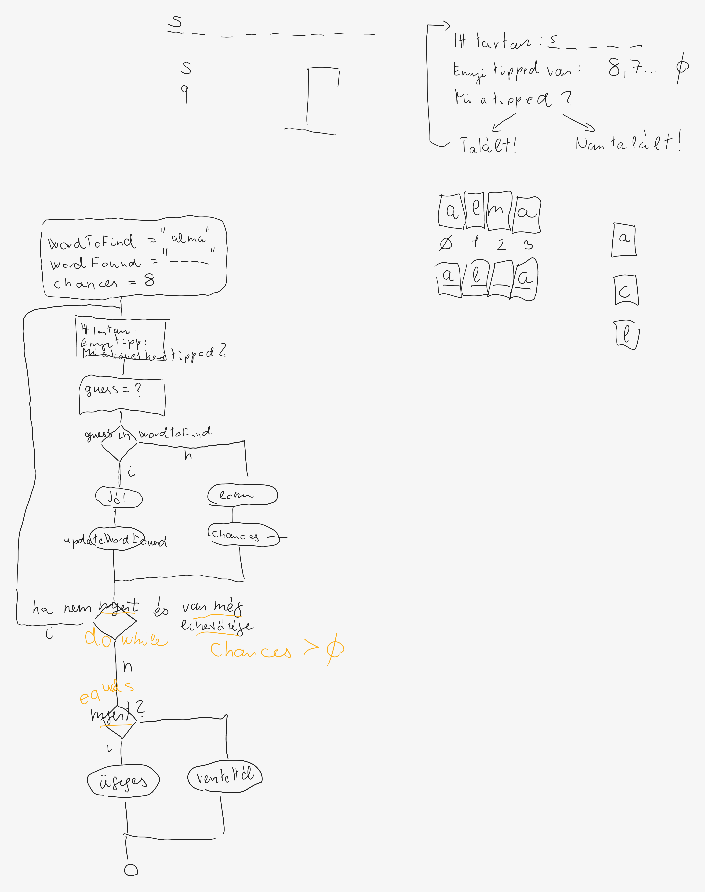

# Konzultáción elhangzó gyakorlati feladatok

Tesztesetek írása akkor is javasolt, ha ez nem szerepel a feladatleírásban.

## WEEK01

A megoldásokat a `java-sv2-daily-labs01` repositoryban, a `week01-lab-tasks` projektben valósítsd meg.

### Day02
Készítsd el a GitHub repository-kat. Az `java-sv2-labs` repository-ban hozz létre egy `selfcheck` könyvtárat, és ide töltsd fel a `week01.md` file-t, melyet a közös repóban érsz el. Valamint a `java-sv2-daily-labs01` repóban hozz létre egy `day02` mappát és ide tölts fel egy képernyőképet!  

### Day04
A `java-sv2-daily-labs01` repón készíts egy day04 mappát és ebben készíts egy `daily-solution` nevű projektet. A projektben legyen egy `week01day04` nevű csomag, ezen belül egy `Hello` nevű osztály, melynek legyen egy `main` metódusa egy kiiratással. 

## Week02
A megoldásokat a `java-sv2-daily-labs02` repositoryban, a `week02-lab-tasks` projektben valósítsd meg.

### Day01
Készíts egy `day01.Human` nevű osztályt. Attribútumai legyenek egy név és egy életkor.
Legyen egy konstruktor ami beállítja ezeket az értékeket. Készíts getter metódusokat az attribútumokhoz. 


### Day02
Készíts egy `day02.Rectangle` (téglalap) nevű osztályt, amelynek két attribútuma a téglalap kétoldalának hossza (ha tudod, akkor lehet lebegőpontos). Készt egy konstruktort, ami beállítja az attribútumok kezdeti értékét. Készíts egy `calculateArea()` nevű metódust, ami visszaadja a téglalap területét! Készíts egy `day02.Geometry` nevű osztályt melyben van egy`main` metódus, itt teszteled az elkészített téglalapokat reprezentáló osztályt! 

### Day04
Készíts egy `day04.Car` osztályt, mely attribútumként tárolja, hogy hány litert a tankoltunk bele, és hány kilométert ment el ekkora mennyiségű üzemanyaggal. Mindkét attribútumhoz legyen setter metódus! Legyen egy metódus ami kiszámolja az autó átlag fogyasztását, azaz azt hogy 100km távolságon mennyit fogyasztott átlagosan.
Legyen egy `day04.GasStation` osztály is melynek legyen egy ár attribútuma, amit konstruktoron keresztül állítunk be. Legyen egy metódusa, a tankolás, ami egy kocsit és egy liter mennyiséget vár paraméterül. Ez a metódus állítsa be a kocsi üzemanyag mennyiségét és adja vissza, hogy mennyit kellett ezért fizetni.
Teszteled az osztályokat main metódusban!

### Day05
Készíts egy `day05.Movie` osztályt. Minden filmnek van egy címe, egy gyártási éve és egy átlagos értékelése. Emellett azt is tárolja, hogy hány értékelés érkezett eddig és mennyi ezek összege. Konstruktorban csak a címet és a gyártási évet állítsd be. Legyen egy metódusa ami egy értékelést vár paraméterül (1-5, egész szám) és beállítja, majd visszaadja az átlagos értékelést. 
Legyen egy `day05.Viewer` nevű osztály is, akinek egy metódusa van a `watchMovie(Movie movie, int rating)` mely meghívja a paraméterül kapott film értékelés metódusát.
Teszteld a munkád egy main metódusban! 

## WEEK03
A megoldásokat a `java-sv2-daily-labs03` repositoryban, a `week03-lab-tasks` projektben valósítsd meg.

### Day01
Készíts egy `day01.Students` osztályt, melyben van egy lista, ami gyerekek magasságát tartalmazza, kezdetben üres.
Készíts egy `addHeight(int height)` nevű metódust, amivel hozzáadhatunk egy magasságot a listához. 
Készíts egy `isHeightsIncreasing()` nevű metódust ami igaz értéket ad vissza, ha a gyerekek magassága növekvő sorrendben van, hamisat ha nem. 
Készíts egy `day01.School` nevű osztályt, amiben van egy `main()` metódus, amiben teszteled az elkészített metódusaidat. 

### Day02
Készíts egy `day02.Mathematics` osztályt, melyben van egy `boolean isPrime(int number)` metódus ami igaz értéket ad vissza, ha a paraméterül kapott szám prím, különben hamisat.

### Day03
Írj egy számkitaláló programot a `GuessTheNumber` osztályba! A program kitalál
egy véletlenszerű számot 1 és 100 között. Majd bekér a felhasználótól ciklusban
számokat.
Mindig megmondja, hogy a szám kisebb, nagyobb vagy egyenlő-e mint a gondolt szám.
Legfeljebb 6-szor lehessen kérdezni, és a felhasználó kapjon visszajelzést arról
is, ha kitalálta és arról is, ha nem!

### Day04
A történet: A török szultán úgy dönt 100 nappal a születésnapja előtt, hogy kienged néhány rabot a 100 cellás börtönéből. A börtönben a zárak kétállásúak, tehát vagy nyitva van vagy zárva. (Nem lehet duplára zárni). Azt parancsolja az őrnek hogy a 100. szülinapjáig minden nap menjen végig a börtönben. Az első napon minden záron fordítson egyet, így minden ajtó nyitva lesz. A második napon, minden második záron fordítson egyet, így minden második ajtó bezáródik. A harmadik napon, minden harmadik záron fordítson egyet. Így ha megnézzük a 3. ajtó zárva lesz, de a 6. nyitva. És ezt a folyamatot folytatja tovább, egészen a 100. napig. Az őr ezt a procedúrát nem akarja minden nap végrehajtani, ezért segítsünk neki és mondjuk meg, hogy a 100. napon mely ajtók lesznek nyitva, azaz végül melyik cellákból szabadulhatnak a rabok.

A feladat megoldásához készíts egy `day04.Prison` nevű osztályt amiben attribútumként tárolod a cellákat valamilyen adatszerkezetben. Az osztályban legyen egy metódus, `void openFreeCells()` melyben megvalósítod, a fenti feladathoz szükséges algoritmust, és a cella attribútumban a megfeleő cellák "nyitva" lesznek. Végül legyen egy `day04.Sultan` nevű osztályod amiben van egy `main()` metódus, amiben példányosítasz egy börtönt, lefuttatod az algoritmust végül kiírod a képernyőre a szabad cellák sorszámát. 


### Day05
Készíts egy `day05.Journal` nevű osztályt mely egy iskolai naplót reprezentál. Legyen benne egy lista amiben a gyerekek neveit tároljuk. Az osztályban legyen egy `boolean addStudent(String studentName)` nevű metódus, ami csak akkor enged hozzáadni a listához egy nevet, ha vezeték és kersztnév is szerepel a névben. Ha teljesül akkor hozzáadja és igaz értékkel tér vissza, ha nem akkor nem adja hozzá és hamis értékkel tér vissza.("Kis Pista" - ok, "Madonna" - nem ok)


## Week04

A megoldásokat a `java-sv2-daily-labs04` repositoryban, a `week04-lab-tasks` projektben valósítsd meg.

### Day01
Készíts egy `day01.Actor` nevű osztályt, melynek attribútumai a színész neve, születési éve. Ezeket konstruktorban állítsd be és készíts hozzájuk gettereket.

Legyen még egy `day01.Movie` osztály is. Ennek 3 attribútuma, a film címe, megjelenés éve és a színészek listája. Első kettőt konstruktorban állítsuk be. Legyen benne egy `addActor(Actor actor)` metódus, amivel egy színészt tudunk hozzáadni a listához. Legyen egy `int actorsInTheirTwenties()` nevű metódus, amivel megszámolod, hogy hány színész járt a 20-as éveiben a film készítésekor. 
(Mivel mindkét osztályban csak év van, így a feladatot úgy kell értelmezni, hogy hányadik életévében jár)

Teszteld a megoldásod main() metódusban.

### Day03

A feladathoz tartozó csomag a `day03`. 

Adott egy részvény, aminek ismerjük a múltbéli napi árfolyamait. A kérdés az, hogyha ezeket az árfolyamokat előre tudtuk volna, akkor mekkora lett volna a legnagyobb profit amit elérhettünk volna?
A feladathoz tartozó main metódus:

```
public static void main(String[] args) {
        Stock stock = new Stock(Arrays.asList(1.23,4.35,0.23,4.0,8.4));
        System.out.println(stock.maxProfit());  //8.17

        Stock stock2 = new Stock(Arrays.asList(12.0,2.0,8.0,4.0));
        System.out.println(stock2.maxProfit()); //6.0
    }
```

### Day04

A feladathoz tartozó csomag a `day04`.

Adott egy osztály a neve legyen `Passenger` ami egy utast reprezentál. Minden utasnak legyen egy neve egy jegy azonosítója (pl.: FK452-1234) és egy csomag mennyisége. 

Egy másik osztály legyen a `Plane`. Minden repülőnek van egy max kapacitás attribútuma és egy utaslistája. Legyen egy `boolean addPassanger(Passanger passanger)` metódus, ami hozzáad egy emebert a listához, ha van még hely, ha nincs akkor hamis értékkel tér vissza.

Legyen egy metódus a `int numberOfPackages()` ami visszaadja, hogy összesen hány bőrönd került fel a gépre. 


## WEEK05
A megoldásokat a `java-sv2-daily-labs05` repositoryban, a `week05-lab-tasks` projektben valósítsd meg.

### Day01

Készíts egy `day01.Movie` nevű osztályt, melyben szerepel a film címe, illetve időpontok listája amikor játszák a moziban (`LocalDateTime`). Mind a két attribútumot konstruktorban állítsuk be. 

Készítsd el a `day01.Cinema` nevű osztályt, melyben filmek listája szerepel. Legyen egy `addMovie(Movie movie)` metódus, amivel filmet lehet hozzáadni a listához. 

Készíts egy `findMovieByTime(LocalDateTime time)` nevű metódust, ami listában visszaadja azon filmek címét, amiket a paraméterül kapott időpontban játszanak. 

A feladathoz tartozó main metódus: 

```java
  public static void main(String[] args) {
        Cinema cinema = new Cinema();

        cinema.addMovie(new Movie("Titanic", Arrays.asList(
                LocalDateTime.of(2021,11,8,12,45),
                LocalDateTime.of(2021,11,8,22,25)
                )));
        cinema.addMovie(new Movie("Jurassic Park", Arrays.asList(
                LocalDateTime.of(2021,11,8,19,45),
                LocalDateTime.of(2021,11,8,20,25),
                LocalDateTime.of(2021,11,8,22,25)
        )));

        System.out.println(cinema.findMovieByTime(LocalDateTime.of(2021,11,8,10,45))); // []
        System.out.println(cinema.findMovieByTime(LocalDateTime.of(2021,11,8,19,45))); // [Jurassic Park]
        System.out.println(cinema.findMovieByTime(LocalDateTime.of(2021,11,8,22,25))); // [Titanic, Jurassic Park]

    }
```
## Week06
A megoldásokat a `java-sv2-daily-labs06` repositoryban, a `week06-lab-tasks` projektben valósítsd meg.

### Day01
 Készíts egy `day01.PositiveNumberContainer` osztályt. Ebben az osztályban, legyen egy lista, ami valós számokat tárol, illetve legyen egy add metódus, ami egy számot hozzáad a listához. Legyen egy `day01.Main` nevű osztályod, benne egy `main` metódussal. A feladat, az hogy addig kérj be számokat és tárold el a listában, amíg pozitív számokat gépel be a felhasználó. Amint érkezik egy nem pozitív szám írd ki az eddig begépelt számokat.

### Day02
Írj unit teszteket a vizsgafeladat 2. (Játék a számokkal) és 3. (Autókereskedés) feladatához. (day02.numbers és day02.cars csomag tartalmazza a forrásállományokat)

### Day03 (opcionális feladatok)

Írj egy metódust, mely visszaad egy tömböt, amelyben 5 db tetszőleges páratlan szám van!

Írj egy metódust, mely paraméterként egy összeget (egész számot) kap, és a magyar fizetési kerekítések szerint visszaadja a fizetendő összeget! (Tehát: Ha a kapott összeg 1-re vagy 2-re végződik, akkor 0-ra kerekít, ha 3-ra, 4-re, 6-ra vagy 7-re, akkor 5-re kerekít, ha pedig 8-ra vagy 9-re, akkor 10-re kerekít. Ha 5-re vagy 0-ra végződik az összeg, akkor nincs kerekítés.)

### Day4 (akasztófa)

A mellékelt folyamatábra alapján készítsd el az akasztófajáték algoritmusát!



```java
package hangman;

import java.util.Scanner;

public class HangmanMain {

    public static void main(String[] args) {
        new HangmanMain().run();
    }

    private void run() {
    }

    private String updateWordFound(String wordToFind, String status, String guess) {
        char[] chars = status.toCharArray();
        for (int i = 0; i < chars.length; i++) {
            if (wordToFind.charAt(i) == guess.charAt(0)) {
                chars[i] = guess.charAt(0);
            }
        }
        return new String(chars);
    }

}

```
### Day05
Készíts egy `day05.Product` nevű oszályt, mely tartalmazza egy termék nevét, típusát (enum) és árát dollárban (double). Készíts egy `day05.Store` nevű osztályt, legyen benne lista és add metódus. Határozd meg, hogy termék típusonként hány termék van a listában. (Ha ismered a Map adatszerkezetet oldd meg nyugodtan azzal)

## Week07
A megoldásokat a `java-sv2-daily-labs07` repositoryban, a `week07-lab-tasks` projektben valósítsd meg.


### Day01
Készíts egy `day01.Human` nevű osztályt. Attribútumai legyenek a neve, a születési éve. Konstruktorban állítsd be az attribútumokat, de figyelj arra, hogy a program futásának pillantában senki nem lehet 120 évesnél öregebb, tehát ha ez nem teljesül, akkor dobjunk `IllegalArgumentException` kivételt. Fontos még, hogy a neve is legalább két részből kell, hogy álljon (vezeték és kersztnév)!
Készíts unit teszteket!


### Day02
Adott egy fájl tartalma:
```
Jurassic park;1993;Steven Spielberg
Titanic;1997;James Cameron
Star Wars;1977;George Lucas
Lord Of The Rings;2002;Peter Jackson
Jaws;1975;Steven Spielberg
```
Hozzd létre az adatokból a `movies.csv` állományt a `src/main/resources` könyvtárban. 
Hozz létre egy `day02.Movie` nevű osztályt, ami a file egy sorát reprezentálja.
Majd készítsd el a `day02.MovieService` nevű osztályt, aminek van egy filmek listája
és konstruktorban beolvassa a paraméterül (Path) átadott file tartalmát!
Készíts unit teszteket!

### Day04 (Csoportmunka)
A feladatban egy biciklis futár egy heti munkáját rögzítjük és készítünk statissztikákat. <br>

A futár minden fuvar után feljegyzi, hogy a hét hányadik napján történt a fuvar. Ezután azt, hogy az adott nap hányadik fuvarját teljesítette és ezután azt, hogy hány kilométer volt az adott fuvar. A futár egy-egy fuvarját reprezentálja a `Ride` nevű osztály, adatagokkal, konstruktorra, getterekkel.<br>

Készítsd el a `Courier` osztályt, ez fogja a futárt reprezentálni. Legyen egy `rides` listája, ami fuvarokat tárol. Legyen egy `addRide(Ride ride)` metódus, ami csak sorrendben enged hozzáadni elemeket a listához. 
Figyeljünk viszont arra, hogy nem feltétlenül minden nap dolgozott a futár, de ha már bekerült egy 3. napi fuvar, akkor ne kerülhessen be egy 2. napi. És arra is figyelj, hogy a napon belül is sorrendben kerüljenek be az adatok. 
Ha a paraméterül kapott `Ride` nem felel meg a feltételeknek dobjunk `IllegalArgumentException`-t.<br>

Legyen egy `CourierFileManager`, amiben van egy `createCourierByFile(Path path)` nevű metódus, ami egy paraméterül kapott
file alapján elkészít egy futár objektumot és visszaadja azt! <br>

Egy minta file:
```
1 1 12
1 2 11
2 1 10
4 1 19
4 2 5
4 3 9
```
Itt látható, hogy a futár nem dolgozott a 3. 5. 6. és 7. napon. 

### Day05
Készíts egy `day05.Product` osztályt, mely egy eladott terméket reprezentál. A terméknek legyen neve, legyen egy eladás dátuma, és egy ára.<br>

Készíts egy `day05.Store` nevű osztályt, amiben eladott termékek listája található. Legyen egy `addProduct(Product p)` metódus, amivel terméket lehet hozzáadni a listához, de ellenőrizzük, hogy az eladás dátuma nem lehet a mai napnál későbbi, különben dobjunk `IllegalArgumentExceptiont`.
Készítsünk még egy metódust, ami egy csv fájlba írja ki a termékeket. A metódus paramétere legyen egy hónap és csak az abban a hónapban eladott termékeket írjuk ki, a termékek adatait pontosvesszővel elválasztva! <br>

Bónusz: A fájl neve legyen a hónapnak megfelelő. 

## Week08
A megoldásokat a `java-sv2-daily-labs08` repositoryban, a `week08-lab-tasks` projektben valósítsd meg.

### Day01

Készíts egy `day01.NumberSequence` osztályt, aminek van egy egész számokból álló listája. Vagy egy kész listát kap konstruktoron keresztül és ez lesz az attribútum értéke, vagy három számot kap, melyből az első hogy hány véletlen számot generáljon a másik kettő pedig a minimum és maximum érték ami között generáljon. Legyen egy metódus `closeToAverage(int value)`, ami kigyűjti és visszaadja azokat a számokat egy listában, amik az átlagtól legfeljebb a paraméterül átadott értékben térnek el! 

### Day02
Készíts egy `day02.Recipe` osztályt, melynek van egy neve, egy hozzávalók listája és egy leírása (minden `String` típusú). Receptet létre lehet hozni csak a neve alapján, vagy név és leírás alapján. <br>
Legyen egy `addIngredient()` metódus, amivel LEGALÁBB egy hozzávalót hozzá lehet adni a listához. (Egyet kötelező!)

### Day04
Az alábbi fájl beolvasása után készíts egy metódust, amely visszaadja, hogy melyik nap volt a legkisebb különbség a napi minimum és maximum hőmérsékletek között! (A feladat megoldásához további segítség a videóban.)

[weather.dat](https://github.com/Training360/java-strukturavalto2-alap/blob/main/consultations/src/main/resources/datamunging/weather.dat)

Házi feladat:
Az alábbi fájl beolvasása után készíts egy metódust A LEHETŐ LEGGYORSABBAN, amely visszaadja, hogy melyik focicsapatnál van a legkisebb különbség a rúgott és a kapott gólok száma között:

[football.dat](https://github.com/Training360/java-strukturavalto2-alap/blob/main/consultations/src/main/resources/datamunging/football.dat)

### Day05
Úgy refactoráld (módosítsd a funkcionalitás változtatása nélkül) a tegnap, házi feladatként megírt kódodat, hogy a lehető legkevesebb kódismétlés legyen benne. Ne feledd, hogy csak úgy tudod biztosítani, hogy az eredmény nem változik, hogy előtte teszteket írsz! (További segítség a videóban.)

## Week09
A megoldásokat a `java-sv2-daily-labs09` repositoryban, a `week09-lab-tasks` projektben valósítsd meg.

### Day01
Az alábbi feladatban egy koncertre való beléptetést fogunk megvalósítani. Adott a `day01.Ticket` osztály. Minden jegyen rajta van, a zenekar neve, a pontos dátum és időpont, és az ár.
Ezeket konstruktorban állítsuk be. Legyen továbbá egy `entryTime()` metódus, ami megmondja, hogy mikor léphetünk be a rendezvényre (csak az időpontot, dátumot már nem). Ez itt legyen egy órával a kezdés előtt. <br>

Legyen egy `day01.FrontOfStageTicket` osztályunk, ami a legjobb helyekre szól és a `Ticket` leszármazottja. Ennek az osztálynak további attribútuma egy extra kód, amivel később olcsóbban tudunk vásárolni. Ezt is konstruktorban állítsuk be. Ilyen típusú jeggyel a koncertkezdés előtt 2 órával tudunk bemenni.<br>

Legyen egy `Person` osztályunk, akinek csupán egy jegy attribútuma van és ezt konstruktorban állítjuk be.<br>

Illetve legyen még egy `Concert` osztály, ami már a rendezvényt reprezentálja és van egy emberek listája. Legyen egy `addPerson()` nevű metódusa, ami egy embert és egy pontos időpontot vár paraméterül és ellenőrzi, hogy az ember be mehet-e a koncertre a kapott időpontban. Ha igen hozzáadjuk a listához, ha nem `IllegalArgumentException`-t dobunk. 
