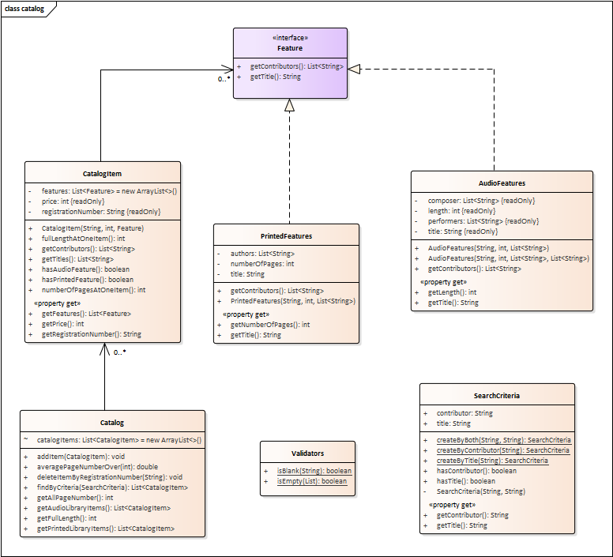

# Katalógus projekt

A feladat egy online könyvtár katalógus rendszerének a szimulációja. A könyvtárban vannak
könyvek, zenei albumok és hangoskönyvek. A könyvek attribútumai között szerepel a címe, szerzője és
az oldalak száma. Az albumok attribútumai között szerepel a címe, előadója, szerzője és hossza.
A hangoskönyv mindkét attribútum halmazzal rendelkezik (ugyanis tároja a hozzá tartozó könyv adatait is).

A feladat reprezentációjához a következő elemeket kell megvalósítani:

* `Feature` interface:
   Ez az interfész jelzi, ha valaminek van címe és vannak közreműködők.
   Két metódussal rendelkező interface. A `getContributors()` visszaadja a katalógus elem 
   közreműködőit (szerzők és előadók is), valamint egy `getTitle()` metódus
   ami az elem címét adja vissza.
   
* `AudioFeatures` osztály:
   Ez az osztály jellemez egy katalóguselemet, ha az audio tulajdonságokkal rendelkezik.
   Ilyen a zenei album és a hangoskönyv. Minden audio elemnek van címe, hossza, előadói,
   illetve szerzői.
   Implementálja a `Feature` interface-t.  A szerzők megadása nem kötelező 
   (két konstruktor szükséges, overload).
   A `getContributors()` metódus a szerzők és előadók közös listájával tér vissza.
   
* `PrintedFeatures` osztály:
   Ez az osztály jellemez egy katalóguselemet, ha az nyomtatott tulajdonságokkal rendelkezik.
   A nyomtatott jellemzők a cím, az oldalszám, illetve a szerzők.
   Szintén a `Feature`-t implementálja. 
   A `getContributors()` itt a szerzőket adja vissza listaként.
   
* `CatalogItem` osztály:
   Minden katalóguselemnek van egy jellemzők listája melyek lehetnek akár nyomtatottak vagy audio-k.
   Továbbá minden katalóguselemnek van ára és egy regisztrációs száma.
   
* `Catalog` osztály:
   A katalógus tartalmazza a katalóguselemek listáját és ebben az osztályban lehet különböző lekérdezéseket végrehajtani.
   Le lehet kérdezni:
   * Az audio illetve nyomtatott jellemzőkkel rendelkező elemeket (`getAudioLibraryItems()`,
    `getPrintedLibraryItems()`)
   * Az összoldalszámot a nyomtatottaknál (`getAllPageNumber()`)
   * Az összhosszt az audio típusúaknál (`getFullLength()`)
   * Az átlag oldalszámot egy bizonyos oldalszám felett (`averagePageNumberOver()`)
   * Keresni lehet egy `SearchCriteria` alapján (lásd lejjebb) (`findByCriteria()`)
   
* `SearchCriteria` osztály:
   Egy immutable osztály melynek attribútumai egy cím és egy szerző. Az osztályt úgy kell megvalósítani, hogy
   akár cím, akár szerző alapján, sőt mindkettő alapján lehessen keresni a katalógusban (statikus metódusokkal lehet
   létrehozni).

* `Validators` osztály:
   Létre kell hozni egy `isBlank()` és `isEmpty()` statikus metódust, az egyik egy Stringről vizsgálja
   meg, null vagy üres-e, a másik egy listáról dönti el, hogy null vagy üres-e. Ezeket a metódusokat
   használhatjuk a metódusok paramétereinek ellenőrzésekor.
   
<!--   [rating feedback=java-catalog] -->
