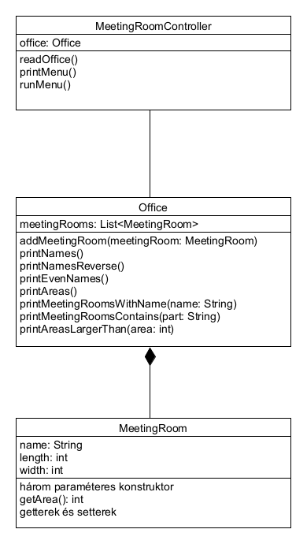

# Projektfeladat - Tárgyaló nyilvántartás

Készíts egy programot, mely egy irodaházban lévő tárgyalókat tartja nyilván!

A program induláskor írjon ki a felhasználónak egy menüt! Ennek tartalma:

```
1. Tárgyaló rögzítése
2. Tárgyalók sorrendben
3. Tárgyalók visszafele sorrendben
4. Minden második tárgyaló
5. Területek
6. Keresés pontos név alapján
7. Keresés névtöredék alapján
8. Keresés terület alapján
9. Kilépés
```

Majd kérjen be a felhasználótól egy számot! Hajtsa végre
a számhoz tartozó funkciót!
A funkció végrehajtása után írja ki újra a menüt! A _Kilépés_
menüpontra lépjen ki.

* Kérje be a tárgyaló nevét, szélességét és hosszúságát méterben, egész számként!
* Tárgyalók sorrendben: csak a neveket kell kiírni olyan sorrendben, ahogy a felhasználó beírta
* Tárgyalók visszafele sorrendben: csak a neveket kell kiírni fordított sorrendben, mint ahogy a felhasználó beírta
* Minden második tárgyaló: minden második tárgyaló nevét kell kiírni
* Területek: ki kell írni minden tárgyaló nevét, szélességét, hosszúságát és területét
* Keresés pontos név alapján: kérj be a felhasználótól egy nevet, és annak a tárgyalónak írd ki a szélességét, hosszúságát és területét, 
  melynek ez a neve. Ha nincs ilyen nevű, nem kell kiírni semmit.
* Keresés névtöredék alapján: kérj be a felhasználótól egy névtöredéket, és annak a tárgyalónak írd ki a szélességét, hosszúságát és területét, 
  amelynek a nevében benne van ez a névtöredék! Ne számítson a kis- és nagybetű különbség!
* Keresés terület alapján: kérj be egy egész számot, és csak azoknak a tárgyalóknak írd ki a nevét, szélességét, hosszúságát és területét, 
  melyeknek a területe nagyobb, mint a felhasználó által beírt terület!

## Osztályok

Dolgozz a `meetingrooms` csomagba!



A `MeetingRoomController` osztálynak legyen egy `main()` metódusa!
Ez példányosít egy `MeetingRoomController` példányt, és meghívja a 
`runMenu()` metódusát.

A `runMenu()` kiírja a menüt a `printMenu()` meghívásával, és
bekéri a felhasználótól a menüpont számát,
majd egy elágazás alapján meghívja az `Office` megfelelő
metódusát. Ha annak kell paraméter, akkor azt ez a metódus
kéri be a felhasználótól.

Az egyes menüpont kiválasztásakor meghívja a `readOffice()` 
metódust. Ez bekéri egy tárgyalót, majd az `addMeetingRoom()`
metódussal beteszi az `Office` példányba.

Az `Office` metódusai rendre megvalósítják a leírt funkciókat.
Ciklusokkal és feltételekkel dolgoznak.

A `MeetingRoom` egy egyszerű osztály, három attribútummal. Van
egy `getArea()` metódusa, mely kiszámolja a tárgyaló területét.