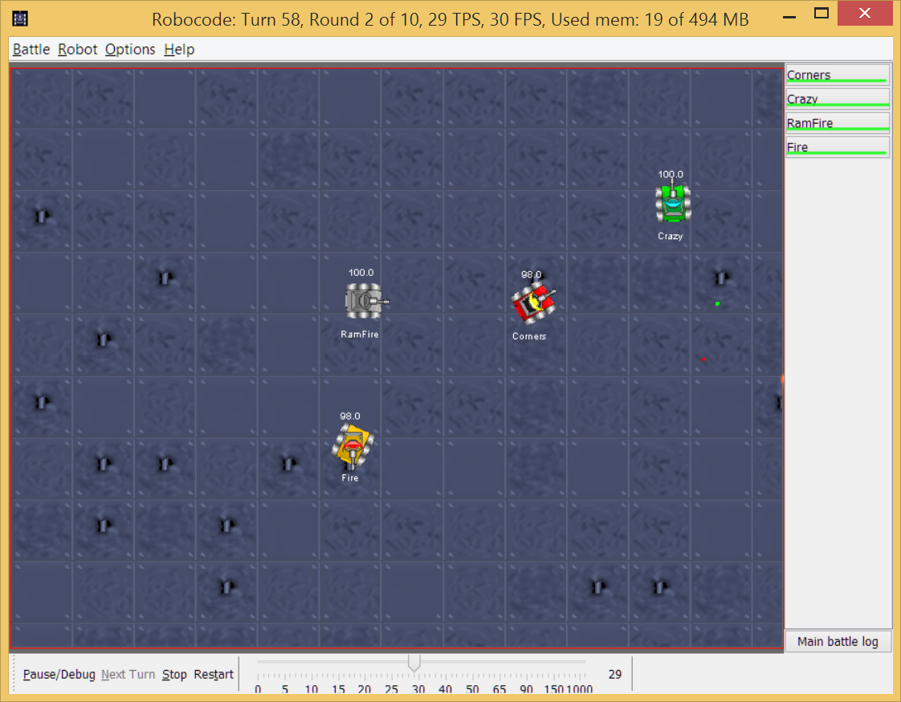

# Projektfeladat

## Bevezetés

A feladat egy virtuális robot programozása, mely egy szoftveres környezetben fut. Ez a környezet elérhető a
http://robocode.sourceforge.net/ címen. Ez egy programozói játék, ahol robot tankok mesterséges intelligenciáját
kell programozni, és cél a többi tank leggyőzése. A csaták vezérlése automatikus, és grafikusan követhető.

A Robocode azért jött létre, hogy játékos keretet biztosítson a Java programozási tudás elmélyítésére.

A futtató környezetbe több saját készítésű tankot is be lehet tölteni, így egymásnak lehet őket
ereszteni. Egymás után több csatát is le lehet futtatni, és pontozási rendszer alapján kerülnek kiválasztásra a
nyertesek.

A robot tankokat Java és .NET platformon lehet megvalósítani.



## Források

A legjobb kiinduló pont a [Wiki](http://robowiki.net/wiki/Main_Page). Valamint a YouTube-on is jó
[tutorial](https://www.youtube.com/watch?v=QQfSnrt5myA) található. A hívható
metódusokat a [Java API](http://robocode.sourceforge.net/docs/robocode/) fejti ki.

## Környezet telepítése

A környezetet a https://sourceforge.net/projects/robocode/files/robocode/1.9.2.6/ címről lehet letölteni.
Telepítése a `java -jar robocode-1.9.2.6-setup.jar` parancs kiadásával történik, majd ki kell választani a könyvtárat,
ahová kerüljön, legyen ez a `C:\Java\robocode` könyvtár.

## Környezet használata

Elindítani a `robocode.bat` segítségével lehet.

Új csata elindításához a Battle / New menüpontot kell használni, kiválasztani pár robotot,
és az Add gombbal a kiválasztottak közé adni. Next gombot megnyomva lehet a csata
paramétereit állítani, majd a Start Battle gomb megnyomásával indítható a csata.

Több forduló kerül lejátszásra, melynek eredményét a végén megjeleníti.

A csata sebességét alul a csúszkával lehet szabályozni. A Pause/Debug
gombot megnyomva leáll a csata, és körönként lehet lépni.
A Main battle log gomb megnyomásával látható a napló.

## Saját robot létrehozása

Bár tartalmaz kódszerkesztési lehetőséget a Robocode, azonban az IDEA fejlesztőeszközt
használjuk.

Létre kell hozni egy JAR állományt, mely összecsomagolva tartalmazza a osztályainkat,
és ezt kell betölteni a Robocode környezetbe.

Ehhez először létre kell hozni egy Maven projektet, a következő `pom.xml` fájlal.
Jó kiindulási pont a `robocode` könyvtár a Git repository-ban.

```xml
<?xml version="1.0" encoding="UTF-8"?>
<project xmlns="http://maven.apache.org/POM/4.0.0"
         xmlns:xsi="http://www.w3.org/2001/XMLSchema-instance"
         xsi:schemaLocation="http://maven.apache.org/POM/4.0.0 http://maven.apache.org/xsd/maven-4.0.0.xsd">
    <modelVersion>4.0.0</modelVersion>

    <groupId>yellowroad</groupId>
    <artifactId>robocode-vicziani</artifactId>
    <version>1.0-SNAPSHOT</version>

    <properties>
        <project.build.sourceEncoding>UTF-8</project.build.sourceEncoding>
        <maven.compiler.source>1.8</maven.compiler.source>
        <maven.compiler.target>1.8</maven.compiler.target>
    </properties>

    <build>
        <finalName>robocode-vicziani</finalName>
    </build>

    <dependencies>
        <dependency>
            <groupId>net.sf.robocode</groupId>
            <artifactId>robocode.api</artifactId>
            <version>1.9.2.1</version>
        </dependency>
    </dependencies>

</project>
```

A `artifactId` és a `finalName` értékét írjuk át a saját nevünknek megfelelően.

Ez tartalmaz egy hivatkozást a Robocode API-ra, hogy hívni tudjunk különböző
metódusokat.

Valamint fontos még a `finalName` alkalmazása, ami megmondja, hogy mi legyen
a JAR fájl neve.

Majd hozzunk létre egy saját osztályt (pl. `yellowroad.ViczianiRobot`),
mely kiterjeszti a `Robot` osztályt.

```java
package yellowroad;

import robocode.Robot;
import robocode.ScannedRobotEvent;

public class ViczianiRobot extends Robot {

    @Override
    public void run() {
        while (true) {
            ahead(100);
            turnGunRight(360);
            back(100);
            turnGunRight(360);
        }
    }

    @Override
    public void onScannedRobot(ScannedRobotEvent e) {
        fire(1);
    }

}
```

Ez a tank előre megy 100 pixelt, majd megforgatja a tornyot, majd hátra megy
100 pixelt, és újra megforgatja a tornyot. Ha másik tankot érzéket, lő.

Létre kell hozni egy az osztállyal megegyező nevű, és azonos könyvtárban
lévő fájlt is. A példánál maradva a `src/main/resources` könyvtárat kell
létrehozni, és abban a `yellowroad` könyvtárban egy `ViczianiRobot.properties`
állományt. A tartalma legyen a következő:

```
#Robocode Robot
robot.description=ViczianiRobot
robot.include.source=false
robocode.version=1.9.2.6
robot.version=1.0
robot.author.name=Viczian Istvan
robot.classname=yellowroad.ViczianiRobot
```

A megfelelő részeket értelemszerűen át kell írni.

Majd ki kell adni a `mvn clean package` parancsot, melynek eredményeként
létrejön a `target` könyvtárban egy, a `finalName` tagben megadott nevű
állomány, esetünkben `robocode-vicziani.jar`.

Ezt kell feltölteni a futtató környezetbe a Robot / Import robot or team
menüpont használatával. Ezután a robotok között megjelenik a saját robotunk is.

## Játékszabályok

A játékszabályokat a http://robowiki.net/wiki/Robocode/Game_Physics oldal írja le.

A robot áll egy törzsből, egy radarból és egy toronyból. A törzsön vannak a lánctalpak,
az végzi a mozgást. A radar mutatja meg az ellenfelek helyzetét. A tornyon van a cső,
amellyel lőni lehet. A radar és a torony egymástól és a törzstől is függetlenül mozog.
A csata helyszíne egy kordinátarendszer, mely bal alsó sarka a 0,0. Irányt
fogban lehet megadni, felfele a 0 fok, jobbra 90 fok, és így tovább.

Az idő a Robocode-ban tick-enként telík. Azért nem valós másodperc alapján, mert
így tetszőlegesen lehet a csatákat gyorsítani és lassítani. Minden robotnak minden
tick egy kör.

A távolságmérés pixelekben történik, de nem feltétlen egész számokkal.
A robotnak 1 pixel/kör/kör gyorsulása van, és 2 pixel/kör/kör lassítása.
Ezt automatikusan számolja a környezet, a programban csak azt kell megadni,
hogy mennyit mozogjon a tank. A tank nem gyorsulhat 8 pixel/kör fölé.

A robot annál lassabban fordul, minnél gyorsabban halad. A torony fordítása
maximum 20 fok körönként. Ha közben a törzs is fordul vele egy irányban, akkor természetesen annak
a forgása is hozzáadódik.

A lövéskor meg kell határozni egy tűzerőt (firepower). Minnél nagyobb, annál
többet sebez. Minnél nagyobb, annál több energiába kerül azt kilőni. Minnél
erősebb a lövedék, annál lassabban halad.

Nem lehet folyamatosan lőni, ugyanis a cső felforrósodik. Minnél erősebb a lövedék,
annál jobban. Addig nem lehet lőni, míg ki nem hül.

Ha a lövedékünk talál, energiát kapunk vissza. Minnél többet sebzünk, annál több
energiát kapunk vissza.

## Hasznos metódusok

* `ahead(double distance)` előre mozog
* `back(double distance)` hátra mozog
* `turnGunLeft(double degrees)`, `turnGunRight(double degrees)` torony mozgatása
* `turnLeft(double degrees)`, `turnRight(double degrees)` törzs mozgatása
* `turnRadarLeft(double degrees)`, `turnRadarRight(double degrees)` radar mozgatása
* `fire(double power)` lő
* `getBattleFieldHeight()` harctér magassága
* `getBattleFieldWidth()` harctér szélessége
* `getX()`, `getY()` robot pozíciója
* `onHitByBullet(HitByBulletEvent event)` akkor hívódik, ha eltalálják
* `onHitRobot(HitRobotEvent event)` akkor hívódik, ha másik tankkal ütközik
* `onHitWall(HitWallEvent event)` akkor hívódik, ha fallal ütközik
* `onScannedRobot(ScannedRobotEvent event)` akkor hívódik, ha meglát egy másik tankot
* `setColors(Color bodyColor, Color gunColor, Color radarColor)` színek beállítása

A további metódusok megtalálhatóak az API-ban.

## Kiírás

Kiírni naplóba a szokványos `System.out.println` metódussal lehet.

## Rajzolás

Ahhoz, hogy a robot rajzolhasson, rá kell kattintani jobb oldalt a nevére,
majd ott a Paint gombra.

Ehhez az `onPaint()` metódust kell implementálni, pl. a következő egy
kört rajzol a tank köré.

```java
public void onPaint(Graphics2D g) {
  g.setColor(Color.red);
  g.drawOval((int) (getX() - 50), (int) (getY() - 50), 100, 100);
  g.setColor(new Color(0, 0xFF, 0, 30));
  g.fillOval((int) (getX() - 60), (int) (getY() - 60), 120, 120);
}
```

A `Graphics2D` metódusai szintén megtalálhatóak a JavaDoc-ban.

## Pontozás

A pontos pontozás megtalálható a [Robocode/Scoring](http://robowiki.net/wiki/Robocode/Scoring)
oldalon. Figyelembe veszi, hogy meddig él az adott robot, mennyit talált, mennyit sebzett,
esetleg megadta a másik tanknak a kegyelemdöfést, valamint az ütközéseket is.

## Feladatok

### Első feladat

A tank színét állítsd be egyedire.
Oda kell találni a álló másik robothoz (ennek neve SittingDuck), a lehető legegyedibb módon.
A tank ezen kívül egy szép egyedi mintát is rajzoljon ki.
A konzolra is írjon ki üzeneteket.

### Második feladat

Találj ki és implementálj egy nyerő stratégiát.
A végén betesszük egy harcszíntérre a robotokat, és egymásnak engedjük, öt
csatában.

[rating feedback=robocode]
