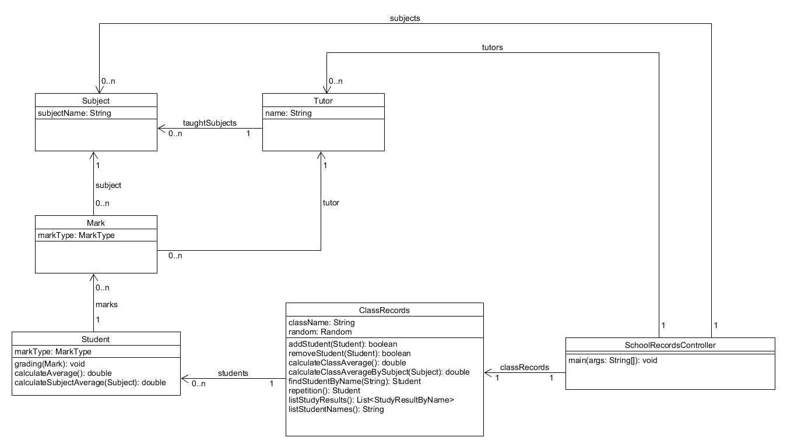

# Elektronikus osztálynapló

## Bevezetés

Elektronikus osztálynaplót (E-napló) kell megvalósítani. Az alkalmazásban a `ClassRecords` osztály magát a naplót reprezentálja,
ahol felvehetők a diákok (`Student`). A `Student` osztályban "tároljuk" a diákok jegyeit `Mark`.
A főbb funkciók a következők:
A diákok osztályozhatók, (jegyeket kapnak), a jegyeik alapján általános- és tantárgyak szerinti átlag számítható, két tizedesjegy
pontossággal. A jegyeik ki is listázhatók a tesztesetekben megadott formában.

A `schoolrecords` csomagba dolgozz!



> Az osztálydiagramon egyes osztályoknál feltüntetett `equals()` metódusokat ne implementáljuk!

A projektfeladathoz tartozó teszteseteket megtaláljátok a képzés publikus GitHub repojában. 
Másoljátok be a saját projektetekbe! Majd hozzátok létre az osztályokat üres metódustörzsekkel, 
hogy leforduljon a projekt.

## Megvalósítási javaslatok

`Subject` osztály:
Egy attribútuma van, a tantárgy nevének tárolására. Ennek alapján azonosítható a tantárgy.

`Tutor` osztály:
Két attribútuma van, a tanár neve és a tanított tantárgyak listája, mindkettő konstruktorból tölthető fel.

publikus metódusok:
```java
public boolean tutorTeachingSubject(Subject subject)
```

`MarkType` enum:
`A(5, "excellent")`, `B(4, "very good")`, `C(3, "improvement needed")`, `D(2, "close fail")`, `F(1, "fail")`
értékeket vehet fel, a klasszikus osztályzatot reprezentálja.

`Mark` osztály:
A diák számára adott jegyeket reprezentálja, az osztályzat "értékét" az attribútumai között egy `MarkType` enum adja.
További attribútumai a következők: `Subject` a tantárgy, amiből kapta a jegyet, `Tutor` a tanár, aki adja a jegyet.
A jegy attribútumai nem állíthatók, ezért csak getter metódusai vannak. Több konstruktorral is létrehozható az objektum.

publikus konstruktorok:

```java
public Mark(MarkType markType, Subject subject, Tutor tutor)
public Mark(String markType, Subject subject, Tutor tutor)
```

publikus metódusok:

```java
public String toString()
```

`StudyResultByName` osztály:
Speciális osztály, a diák nevét és tantárgyi átlagát tartalmazza.
Attribútumai a diák neve és az össztantárgyi átlaga, konstruktorból
feltöltve (csak getter metódusok!).

`Student` osztály:
A diák adatait - jelen esetben csak a nevét (konstruktorból feltöltve, csak getter metódus) - és a jegyeit tárolja,
metódusai ezeken dolgoznak.
A diák azonosítása a nevén keresztül történik. A `toString()` metódus a teszteseteknél látható módon
a diák nevét és a jegyeit listázza ki szöveges formában.

publikus metódusok:
```java
public void grading(Mark mark) // érdemjegy rögzítése
public double calculateAverage() // teljes átlag számolása
public double calculateSubjectAverage(Subject subject) // tantárgyhoz tartozó átlag számítása
public String toString() // diák szöveges reprezentációja
```

`ClassRecords` osztály, a régi papíralapú napló egyes funkcióit reprezentálja.
Attribútuma az osztály neve, egy `Random` objektum (konstruktorból beállítva),
valamint a diákok listája.
Diákot adhatunk hozzá és el is távolíthatunk, előbbi esetben már létező nevű
diákot nem adhatunk hozzá, és eltávolítani
csak olyat lehet, aki már ott van a listában (ismét név alapján).
Osztályátlagot tud számolni általánosan és tantárgy alapján,
véletlenszerűen ki tud választani egy diákot felelésre, meg tud keresni egy diákot név alapján
és ki tudja listázni a diákok neveit és átlagát a `StudyResultByName` osztály
objektumainak listájaként.

publikus metódusok:
```java
public boolean addStudent(Student student) // felvesz egy diákot az osztályba
public boolean removeStudent(Student student) //kivesz egy diákot az osztályból
public double calculateClassAverage() //osztályátlagot számol, minden diákot figyelembe véve
public double calculateClassAverageBySubject(Subject subject) //tantárgy szerinti osztályátlagot számol,
// kihagyja azon diákokat, akiknek az adott tantárgyból nincs jegye
public Student findStudentByName(String name) // név szerint megkeres egy diákot az osztályban
public Student repetition() //felelethez a listából random módon kiválaszt egy diákot
public List<StudyResultByName> listStudyResults() //a diákok nevét és tanulmányi átlagát egy-egy új objektumba viszi,
// és azok listáját adja vissza
public String listStudentNames() //kilistázza a diákok neveit, vesszővel elválasztva
```

## Tippek

A listák mindig privát attribútumok, nem lehet hozzájuk getter metódus!
A `Random` objektumot a `ClassRecords` osztály konstruktorban vegye át a tesztelhetőség miatt.
A String paraméterek nem lehetnek üresek vagy `null` értékűek. Ezt a vizsgálatot célszerűen egy külön,
privát metódus végezze, amit minden olyan osztályban létre kell hozni, ahol használatra kerül:

```java
private boolean isEmpty(String str)
```

## Hibakezelés

Törekedjünk az átfogó hibakezelésre! A teszteseteknél látható módon `NullPointerException`-t várunk,
ha a megfelelő metódust `null` értékkel hívták meg,
ha a `String` paraméter `isEmpty()` (lásd a tippeknél) akkor a megfelelő szöveggel `IllegalArgumentException`-t várunk.
Az osztályszintű átlagszámítások során `ArithmeticException`-t várunk a megfelelő szöveggel,
ha valamiért nem lehet a számítást elvégezni (nincs jegy, nincs diák felvéve az osztályba, stb.).

<!-- [rating feedback=java-schoolrecords] -->

## Main

Az elsődleges cél, hogy a tesztesetek hiba nélkül lefussanak. Azonban ha szeretnél belőle működő
konzolos alkalmazást, akkor oldd meg ezt a feladatot is!

Hozz létre egy `SchoolRecordsController` osztályt, melyben van a `main()` metódus!
Ez csak példányosítsa az osztályt, és hívja meg a metódusait.
Van egy `ClassRecords` attribútuma, melyet példányosít. Ezen kívül van egy tantárgy lista,
és egy tanár lista attribútuma. Ezeket töltsd fel a `initSchool()` metódusban.
(Ezeket nem kell a felhasználótól bekérni.)

Majd írd ki a következő menüt:

```
1. Diákok nevének listázása
2. Diák név alapján keresése
3. Diák létrehozása
4. Diák név alapján törlése
5. Diák feleltetése
6. Osztályátlag kiszámolása
7. Tantárgyi átlag kiszámolása
8. Diákok átlagának megjelenítése
9. Diák átlagának kiírása
10. Diák tantárgyhoz tartozó átlagának kiírása
11. Kilépés
```

Amíg a kilépést meg nem nyomja, a menüpont elvégzése után újra ki kell írni a menüt.

Érdemes a menüpontok működését a `SchoolRecordsController` osztályon belül külön metódusokban implementálni.

Menüpontonként a következő működés az elvárt:

* Diákok nevének listázása - kilistázza a diákok neveit (`listStudentNames()`)
* Diák név alapján keresése - bekéri a diák nevét, és a diák szöveges reprezentációját írja ki (`findStudentByName()`)
* Diák létrehozása - bekéri a diák nevét, és felviszi (`new Student()`, valamint `addStudent()`)
* Diák név alapján törlése - be kell kérni a nevét, és az első találatot törölni (először egy `findStudentByName()` majd egy `removeStudent()` hívás)
* Diák feleltetése - előbb sorsolni kell egy diákot, meg kell hívni a `repetition()` metódust, bekérni az érdemjegyet, tárgy nevét, oktató nevét. A tárgyat és az oktatót kikeresni a listából, példányosítani ezekkel egy `Mark`-ot, és meghívni a `grading()` metódust.
* Osztályátlag kiszámolása - `calculateClassAverage()` eredményének kiírása
* Tantárgyi átlag kiszámolása - `calculateClassAverageBySubject()` eredményének kiírása
* Diákok átlagának megjelenítése - `listStudyResults()` eredményének kiírása
* Diák átlagának kiírása - be kell kérni a nevét, `findStudentByName()`, majd az eredményen `calculateAverage()`
* Diák tantárgyhoz tartozó átlagának kiírása - be kell kérni a nevét, majd a tantárgy nevét. `findStudentByName()`, majd ki kell keresni a tantárgyat a listából, majd `calculateSubjectAverage(Subject)` hívás
* Kilépés